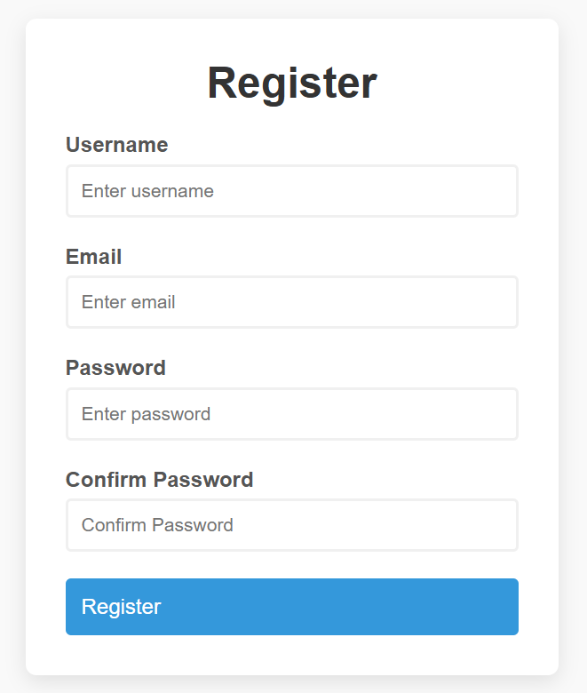
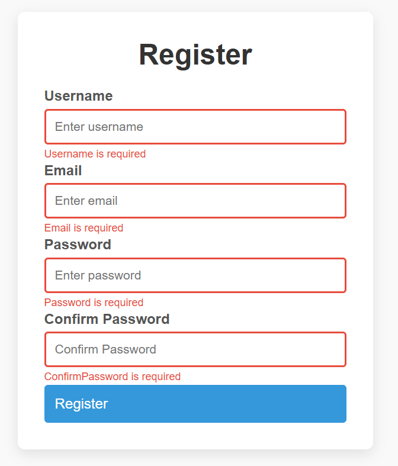
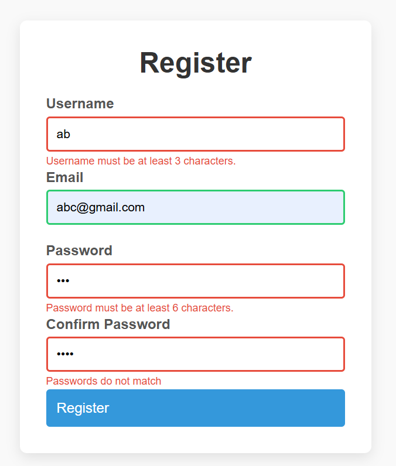
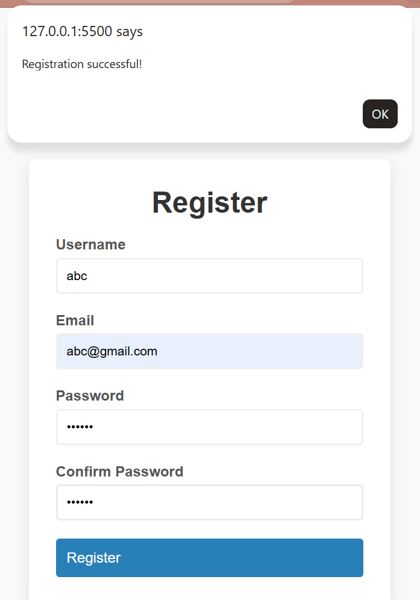

# 📝 Interactive Form Validator

A robust client-side validation system. This project demonstrates high-quality User Experience (UX) by providing real-time feedback, email pattern matching, and password verification.

---

## 🚀 Live Demo
[▶️ Test the Validator Here](https://dhruti05.github.io/form-validator/Form-Validator/index.html).

---

## 📸 Project Showcase

| Required Fields | Validation Errors | Success State |
| :---: | :---: | :---: |
|  |  |  | |

---

## ✨ Key Features
* **Real-time Validation:** Dynamic border colors (Red/Green) based on input validity.
* **Regex Integration:** Validates email formats using standard Regular Expressions.
* **Reusable Logic:** Uses a `checkRequired` function to validate multiple inputs efficiently.
* **Smart Formatting:** Automatically formats field IDs (e.g., "confirmPassword" becomes "ConfirmPassword") for error messages using JavaScript.

## 🛠️ Technical Concepts
* **Template Literals:** Used backticks (`` ` ``) for dynamic error strings.
* **DOM Traversal:** Efficiently targeting `<small>` tags for error messages.
* **Event Prevention:** `e.preventDefault()` to manage form submission logic.

---
Developed with 🧡 by Dhruti
